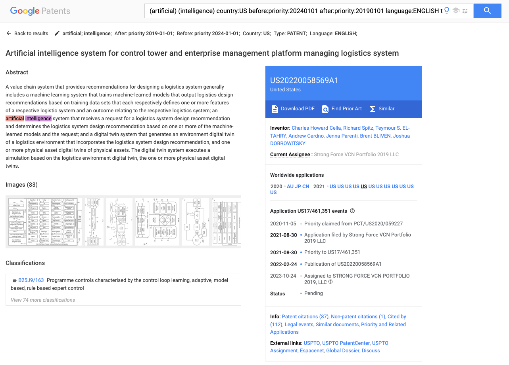

# final-project-les-deux-mousquetaires
This is the final project for MACS 30123 course Large-Scale Computing for the Social Sciences owned by Guankun Li and Tianyue Cong.

## Scraping
We chose to scrape the patents related to artifical intelligence from 2019 to 2023 using [Google Patents](https://patents.google.com/). We used midway3 to download a total of 382071 individual patents related to artifical intelligence (see [`download_patent_midway.py`](scraping/download_patent_midway.py) file). 

Underlying this python script, we utilized `selenium` package to dyanmically **search** and **download** relevant patent records to `all_patents_link.csv` file on [shared Google Drive](https://drive.google.com/drive/u/0/folders/1WVNa82HSAvxmRaRiNh5k4_ZN-g6WbEua?ths=true) file. See the [figure of example](screenshots/Selenium_Scraping.png) below: 


Specifically, after initializng the selenium drive, we used to following code to search for US patents with the keywords of artificial and intelligence during the time period between after_date and before_date (in our case, 2019.1.1 - 2024.1.1):
```python
url = f'https://patents.google.com/?q=(artificial+intelligence)&country=US&before=publication:{before_date}&after=publication:{after_date}&language=ENGLISH&type=PATENT'
```

Following that, we waited for the links (for each patent) to be clickable and then clicked them to download the csv file:
```python
# Download csv files of patent data for each month
download_css_selector = "a[href*='download=true'] iron-icon[icon='icons:file-download']"
# Wait for the link to be clickable and click it
link = WebDriverWait(driver, 10).until(
    EC.element_to_be_clickable((By.CSS_SELECTOR, download_css_selector))
)
link.click()
# Wait for files to be downloaded
time.sleep(15)
```

As shown in the `all_patents_link.csv` file on shared Google Drive, the csv file stores (Google Patents) information about each patent and, more importantly, it stores the URL link to detailed information about the patent on Google Patents. The specific schema of `all_patents_link.csv` file summarized as below:
| Column Name                     | Description                                                                                       |
|---------------------------------|---------------------------------------------------------------------------------------------------|
| `id`                            | The unique identifier of the patent, formatted with hyphens (e.g., US-10171659-B2).              |
| `title`                         | The title of the patent.                                                                          |
| `assignee`                      | The entity to which the patent is assigned (e.g., a company or individual).                      |
| `inventor/author`               | The names of the inventors or authors of the patent.                                              |
| `priority date`                 | The date on which the patent application was first filed.                                         |
| `filing/creation date`          | The date on which the patent application was officially filed or created.                        |
| `publication date`              | The date on which the patent was published.                                                      |
| `grant date`                    | The date on which the patent was granted.                                                        |
| `result link`                   | The URL link to the detailed information about the patent on Google Patents.                      |
| `representative figure link`    | The URL link to the representative figure or image of the patent.                                |

We then used `request` package to retreive the details (e.g., paper abstract, classification, citation records) of each patent based on the `result link` column in `all_patents_link.csv` file above (see an example of webpage accessed from the `result link`):



As shown in [`scrape_each_patent_linux_local.py` file](scraping/scrape_each_patent_linux_local.py), we scraped text of `request` responses and uploaded individual text files to aws s3 bucket (given the large )

The strategic choice of scraping twice (one using `selenium` and the other using `request`)
why use midway
also why upload to aws s3

Use request to scrape abstract and classification from the URL link to detailed information about the patent (see figure of example below):