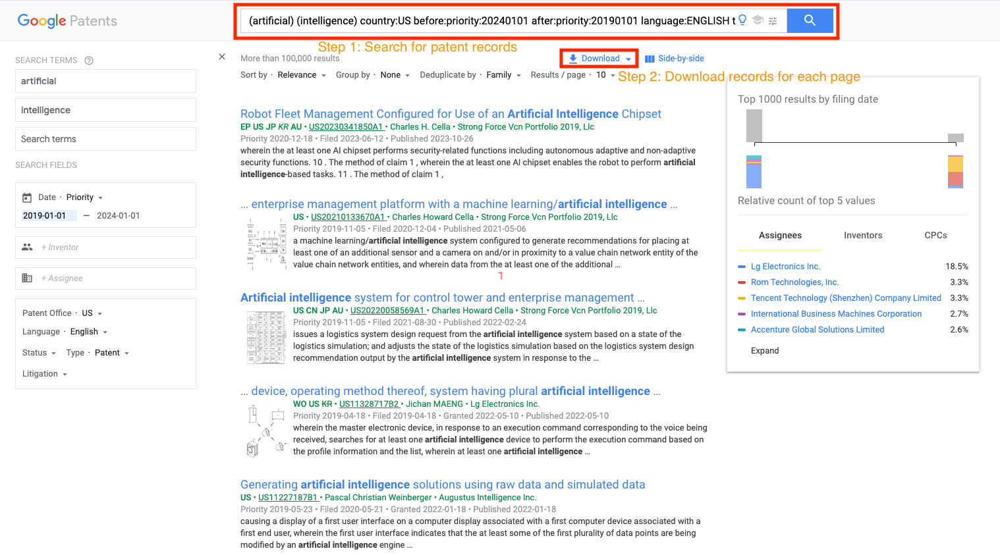

# Large-Scale Analysis of Patents in Artificial Intelligence: Trends and Network Insights
This is the final project for MACS 30123 course Large-Scale Computing for the Social Sciences owned by Guankun Li and Tianyue Cong. In this project, we utilized high performance computing techniques to scrape information about patents in the field of artifical intelligence (between 2019 and 2023) and conduct large-scale analysis, including clustering and network analysis, to explore the research (patent) trend in the field of artifical intelligence and the citation patterns during this period.

## Responsibilities
- Guankun Li: Web scraping, Clustering & Trends
- Tianyue Cong: Web scraping, Network Analysis

## Research Questions

1. **Are there distinct subfields within the domain of AI patents? If so, what are the characteristics of these subfields?**

2. **Which subfields of AI are more popular, and what trends do they exhibit? How might these subfields develop in the future?**

3. **What are the characteristics of the patent network formed through citations in the AI field? Do patents in different subfields exhibit distinct network properties?**

4. **What is the Knowledge Exploration Distance of AI patents? Are they highly diverse or similar?**

## Social Science Significance

This study holds significant social science importance in multiple ways, including the analysis of technological trends, the structure of innovation networks, and the impact on various socio-economic factors.

### Importance of Analyzing AI Patents

AI is rapidly transforming various industries, driving advancements in fields such as healthcare, finance, and neuroscience. Patents are a vital indicator of technological innovation, representing the forefront of research and development. By analyzing AI patents, we can gain insights into **Technological Trends and Innovation Dynamics**. For example, by examining the growth in patents related to AI subfields like image processing or natural language processing, we can identify which areas are experiencing rapid development and which are plateauing (Henderson, Jaffe, & Trajtenberg, 1998). This understanding can inform strategic investment decisions and policy formulations aimed at fostering innovation (OECD, 2015).

Identifying distinct subfields within AI patents allows for a more granular understanding of innovation. This classification can reveal the specific characteristics and focus areas within the broader AI domain, helping policymakers and researchers prioritize funding and support (Griliches, 1990). Such insights are crucial for tailoring education and training programs to meet the demands of emerging technological fields (National Academy of Sciences, 2017).

### Importance of Patent Network Analysis

Analyzing the citation network of AI patents provides insights into the structure and dynamics of knowledge dissemination. Citation networks illustrate how innovations build upon each other, highlighting influential patents and seminal technologies. This analysis is critical for several reasons:

1.**Knowledge Flow and Innovation Clusters**:
Citation networks reveal how knowledge flows between different entities and technological domains. Understanding these networks can identify innovation clusters and influential patents, guiding strategic decisions in research and development (Singh, 2005). This can also highlight potential collaborations and partnerships that can accelerate technological advancements (Breschi & Lissoni, 2001).

2.**Interdisciplinary Connections**:
AI is inherently interdisciplinary, often combining insights from computer science, engineering, and domain-specific knowledge. By examining citation patterns, we can uncover how different fields contribute to AI advancements and foster interdisciplinary collaboration (Narin, Hamilton, & Olivastro, 1997). This understanding can enhance the design of interdisciplinary research initiatives and funding programs (Porter & Rafols, 2009).

## Computational Challenges and Scalability

We encountered computational challenges, and to address these, we had to use scalable computing methods.

1. **Scraping and Data Storage**:
   - Our project involved scraping a large volume of raw text data, exceeding 200GB. To manage and store this data efficiently, we utilized AWS S3, which offers virtually unlimited storage capacity and automatic scalability. For processing this extensive dataset, we employed midway's mpi4py to enable parallel processing, ensuring that our data handling was both efficient and scalable. This approach allowed us to distribute the workload across multiple processors, significantly speeding up the data processing tasks.

2. **NLP and Clustering**:
   - Processing and analyzing the vast amount of textual data for NLP and clustering presented significant computational challenges. To handle this, we used PySpark, a powerful distributed computing framework. PySpark's ability to process large datasets in parallel across a cluster of machines made it ideal for our needs. This distributed approach ensured efficient utilization of computational resources and allowed us to scale our NLP and clustering computations as the dataset grew. PySpark also provided robust libraries for text processing and machine learning, facilitating complex analysis at scale.

3. **Network Analysis**:
   - Constructing and analyzing a network with over 500,000 nodes and edges required substantial computational power. We addressed this challenge by leveraging both PySpark and Dask. PySpark was used for the initial data processing and feature extraction, while Dask provided the necessary scalability for the detailed network analysis and visualization tasks. By combining these tools, we were able to compute network characteristics and generate visualizations efficiently, even with the large scale of our data. This hybrid approach ensured that our network analysis was both comprehensive and scalable.


## Scraping
We chose to scrape the patents related to artifical intelligence from 2019 to 2023 using [Google Patents](https://patents.google.com/). We used midway3 to download a total of 382071 individual patents related to artifical intelligence (see [`download_patent_midway.py`](scraping/download_patent_midway.py) file). 

Underlying this python script, we utilized `selenium` package to dyanmically **search** and **download** relevant patent records to `all_patents_link.csv` file on [shared Google Drive](https://drive.google.com/drive/u/0/folders/1WVNa82HSAvxmRaRiNh5k4_ZN-g6WbEua?ths=true). See the [figure of example](screenshots/Selenium_Scraping.png) below: 



Specifically, after initializng the selenium drive, we used to following code to search for US patents with the keywords of artificial and intelligence during the time period between after_date and before_date (in our case, 2019.1.1 - 2024.1.1):
```python
url = f'https://patents.google.com/?q=(artificial+intelligence)&country=US&before=publication:{before_date}&after=publication:{after_date}&language=ENGLISH&type=PATENT'
```

Afterwards, we waited for the links (for each patent) to be clickable and then clicked them to download the csv file:
```python
# Download csv files of patent data for each month
download_css_selector = "a[href*='download=true'] iron-icon[icon='icons:file-download']"
# Wait for the link to be clickable and click it
link = WebDriverWait(driver, 10).until(
    EC.element_to_be_clickable((By.CSS_SELECTOR, download_css_selector))
)
link.click()
# Wait for files to be downloaded
time.sleep(15)
```

As shown in the `all_patents_link.csv` file on shared Google Drive, the csv file stores (Google Patents) information about each patent and, more importantly, it stores the URL link to detailed information about the patent on Google Patents. The specific schema of `all_patents_link.csv` file summarized as below:
| Column Name                     | Description                                                                                       |
|---------------------------------|---------------------------------------------------------------------------------------------------|
| `id`                            | The unique identifier of the patent, formatted with hyphens (e.g., US-10171659-B2).              |
| `title`                         | The title of the patent.                                                                          |
| `assignee`                      | The entity to which the patent is assigned (e.g., a company or individual).                      |
| `inventor/author`               | The names of the inventors or authors of the patent.                                              |
| `priority date`                 | The date on which the patent application was first filed.                                         |
| `filing/creation date`          | The date on which the patent application was officially filed or created.                        |
| `publication date`              | The date on which the patent was published.                                                      |
| `grant date`                    | The date on which the patent was granted.                                                        |
| `result link`                   | The URL link to the detailed information about the patent on Google Patents.                      |
| `representative figure link`    | The URL link to the representative figure or image of the patent.                                |

We then used `request` package to retreive the details (e.g., paper abstract, classification, citation records) of each patent based on the `result link` column in `all_patents_link.csv` file above (see an example of webpage accessed from the `result link`):


As shown in [`scrape_each_patent_linux_local.py` file](scraping/scrape_each_patent_linux_local.py), we scraped text of `request` responses and uploaded individual text files to aws s3 bucket (given the large file size of all patent records combined). 

The strategic choice of scraping twice (one using `selenium` and the other using `request`) is due to the fact that it is very likely to be detected as a bot when clicking the links to patent details (given the very large number of patents). Although we tried writing aws lambda functions to scrape patent details, the 4-hour limit of our aws account makes it cumbersome to restart aws lab and update aws credentials multiple times given the large number of patents to scrape.

## Data Cleaning
An important step after scraping is converting all patent records (stored on s3 bucket) to a csv file. To extract relevant information from the 382071 individual patents, we utlizied Message Passing Interface (MPI) to access all objects in our s3 buckets and extract information including patent id, patent abstract, classification, timeline, citation records, and legal events into a concatenated csv (see below):
```python
# Format of dataframe storing patent information
df = pd.DataFrame({
        'id': [file_id],
        'abstract': [abstract],
        'classification': classifications,
        'timeline': [str(timeline_dict)],
        'citedby': [str(cited_by_dict)],
        'legal': [str(legal_events_dict)]
    })
```
```python
# Gather all DataFrames at the root process
all_dfs = comm.gather(local_df, root=0)

if rank == 0:
    print("Combining all DataFrames...")
    final_df = pd.concat(all_dfs, ignore_index=True)
    final_df.to_csv('patent_data.csv', index=False)
    print("Data saved to CSV successfully")
```

For more details on this step, please refer to [`s3_download_txt_to_csv_mpi.py`](data_cleaning/s3_download_txt_to_csv_mpi.py) file (**NOTE**: we also included a version of python script that does not utilize parallel processing; see [`txt_to_csv.py`](data_cleaning/txt_to_csv.py) file). To perform this operation, we submitted the [`mpi.sbatch`](data_cleaning/mpi.sbatch) sbatch file to midway:
```bash
cd data_cleaning
sbatch mpi.sbatch
cd ..
```

After having this csv, we joined it with the `all_patents_link.csv` file to incorporate the finest details of each patent for later analysis. Named as `all_patent_info.csv`, this combined dataframe is saved on [shared Google Drive](https://drive.google.com/drive/u/0/folders/1WVNa82HSAvxmRaRiNh5k4_ZN-g6WbEua?ths=true)) and lays the foundation for our later analysis. 

## Clustering

We used PySpark NLP to extract keywords from the abstracts of AI patents and then analyzed these keywords to determine the number of clusters for the AI patents. Based on the elbow plot, the optimal number of clusters is determined by identifying the point where the decrease in the sum of squared errors (SSE) starts to slow down, forming an "elbow" shape. This point indicates diminishing returns in reducing SSE with the addition of more clusters.

Based on the principle of the Elbow Method, the optimal number of clusters is typically identified where the decrease in the sum of squared errors (SSE) starts to slow down significantly, forming an "elbow" shape. However, in our elbow plot, the SSE exhibits a different pattern. Upon examining the plot, it's evident that the SSE continues to decrease up to around 12 clusters, beyond which there is a subtle but noticeable increase in SSE, indicating a local minimum at 12 clusters. This suggests that 12 clusters is a point where the SSE is minimized locally, and adding more clusters beyond this point results in only marginal or even detrimental changes to the SSE. Thus, choosing 12 as the optimal number of clusters strikes a balance between model complexity and clustering performance, ensuring meaningful and distinct groupings without overfitting the data. This local minimum at 12 clusters suggests that further increasing the number of clusters might introduce noise rather than improving the clustering quality. 


We analyzed each cluster by examining the top 50 keywords for each cluster. These keywords were then inputted into ChatGPT to generate a detailed description representing each cluster.

| Cluster | Cluster Name                         | Description                                      |
|---------|--------------------------------------|--------------------------------------------------|
| 0       | General Machine Learning and Systems | Focuses on general machine learning methods and system configurations, including data processing, system integration, model training, and control mechanisms. |
| 1       | Image Processing and Recognition     | Involves techniques for processing and recognizing images, including methods for image analysis, object detection, image enhancement, and medical imaging. |
| 2       | Document Management and Text Processing | Pertains to handling and analyzing text and documents, involving document retrieval, text classification, content extraction, and digital document management systems. |
| 3       | Sample Analysis and Training Models  | Covers methods for analyzing samples and training models, including data sampling, model training, image analysis, and statistical methods for data evaluation. |
| 4       | User Interaction and Content Management | Deals with user interfaces and content management systems, focusing on user data interaction, content delivery, media services, and user request handling. |
| 5       | Virtual Reality and Augmented Reality | Encompasses technologies related to virtual and augmented reality, including virtual environments, physical interaction, display systems, and augmented reality applications. |
| 6       | Resource Management and Communication | Involves management of resources and communication systems, including resource allocation, network management, wireless communication, and data transmission. |
| 7       | Authentication and Security          | Focuses on user authentication and security measures, including biometric identification, security protocols, access control, and data protection mechanisms. |
| 8       | Signal Processing and Wireless Communication | Pertains to processing signals and wireless communication technologies, including signal modulation, wireless networks, data transmission, and communication protocols. |
| 9       | Feature Extraction and Machine Learning | Involves extracting features and applying machine learning techniques, including feature engineering, neural networks, classification algorithms, and training models. |
| 10      | Financial Transactions and Payment Systems | Deals with handling financial transactions and payment systems, including transaction processing, payment methods, fraud detection, and blockchain technologies. |
| 11      | Audio Processing and Speech Recognition | Encompasses audio processing and speech recognition technologies, including signal processing, voice recognition, audio encoding, and speech-to-text systems. |

### **Wordcloud Analysis for Clustering Results**

To provide a clearer visualization of the contents of each cluster, we have generated word clouds for each of the 12 clusters. Each word cloud displays the most frequently occurring words in the abstracts assigned to the respective cluster. This visual representation helps in understanding the dominant themes and topics within each cluster. Below, we provide a general analysis of how these word clouds align with our naming conventions for each cluster, using a couple of clusters as examples to illustrate the consistency.

Across all clusters, the word clouds consistently reflect the main themes identified in the cluster names. For instance, clusters related to document management prominently feature terms like "document" and "text," while those focused on user interaction highlight words such as "user" and "content." This consistency demonstrates that our clustering and naming process effectively captures the key topics and technological areas represented in the patent abstracts.


### Quantity and Quality of Patents

We further analyzed the AI patents in different clusters in terms of quantity and quality. Quantity is measured by the number of patents within each cluster, while quality is determined by the average number of citations per patent in each cluster. The results are presented in two bar charts: the first chart displays the number of patents per cluster, and the second chart shows the average quality of patents based on citations.

The first chart reveals significant disparities in the number of patents across clusters. Notably, "User Interaction and Content Management" and "Signal Processing and Wireless Communication" exhibit the highest patent counts, with "User Interaction and Content Management" leading by a substantial margin. This indicates a higher concentration of patents in these clusters, possibly reflecting areas of intense research and development activity. In contrast, clusters such as "Sample Analysis and Training Models," "Virtual Reality and Augmented Reality," and "Authentication and Security" have notably fewer patents, suggesting either niche fields or areas with less research focus.

The second chart, which shows the average quality of patents based on citations per patent, provides a different perspective. Interestingly, "Authentication and Security" stands out with the highest average quality, indicating that, despite having fewer patents, the patents in this cluster are highly influential. "Virtual Reality and Augmented Reality" and "Signal Processing and Wireless Communication" also demonstrate high average quality, suggesting that patents in these clusters are well-cited and possibly more impactful.

The combined analysis from both charts reveals a nuanced landscape. For example, while "User Interaction and Content Management" has the highest number of patents, its average quality is moderate, indicating a large volume but not necessarily high-impact patents. Conversely, "Authentication and Security," with fewer patents, shows exceptional quality, highlighting the importance of considering both quantity and quality for a comprehensive understanding of patent landscapes.


## Analysis of AI Patent Trends

#### Removal of Cluster 0
Cluster 0, "General Machine Learning and Systems," was removed from the trend analysis because it is too broad and can be further subdivided into more specific categories. This broad categorization does not provide actionable insights into the particular advancements and trends within the various subfields of AI. By excluding Cluster 0, we can focus more accurately on specific technological developments and their trajectories.

#### Trend Analysis of the Top Three Clusters
The trend analysis focuses on the top three clusters with the highest number of patents over time, which are Cluster 8, Cluster 1, and Cluster 4.

1. **Cluster 8 (Signal Processing and Wireless Communication)**:
   - **Trend**: This cluster consistently has the highest number of patents. From Q1 2019 to Q4 2023, the number of patents increased from around 1500 to over 3500.
   - **Analysis**: The steady rise in patents indicates continuous innovation and significant interest in signal processing and wireless communication technologies. This could be driven by the growing demand for advanced communication systems, 5G technology, and the increasing importance of robust signal processing methods in various applications.

2. **Cluster 1 (Image Processing and Recognition)**:
   - **Trend**: Patents in this cluster also show a steady increase, though at a slightly slower rate compared to Cluster 8. The number of patents has grown consistently over the observed period.
   - **Analysis**: The upward trend highlights the ongoing advancements and importance of image processing and recognition technologies. These technologies are critical in numerous applications, including medical imaging, autonomous vehicles, and security systems, reflecting their broad applicability and the substantial research and development efforts in this area.

3. **Cluster 4 (User Interaction and Content Management)**:
   - **Trend**: The number of patents in this cluster has significantly increased, showing a robust upward trajectory from Q1 2019 to Q4 2023.
   - **Analysis**: The growth in patents related to user interaction and content management suggests that this area is becoming increasingly important as digital and smart technologies evolve. Innovations in user interfaces and content management systems are essential for enhancing user experience and managing the growing volumes of digital content effectively.


#### 
Clusters 8, 1, and 4 were removed from the trend analysis to provide a clearer view of the remaining clusters' trends. These clusters had significantly higher numbers of patents, which could obscure the trends in clusters with fewer patents.

The trends for the remaining clusters indicate that the number of patents in each cluster has generally increased over time. There is a noticeable synchronous pattern in their growth, suggesting that innovations across these different areas of AI have progressed simultaneously.

- **Cluster 9 (Feature Extraction and Machine Learning)**:
  - **Trend**: This cluster shows the highest number of patents among the remaining clusters. There is a steady increase from around 200 patents in early 2019 to over 500 patents by the end of 2023.
  - **Analysis**: The growth in Cluster 9 suggests a strong and continuous interest in feature extraction and machine learning technologies. This area is foundational to many AI applications, which likely drives the sustained increase in patent filings.


## Network
For the patent citation network analysis, we focused on two levels of analysis: one for assignee-level and the other for patent-level. For the **assignee-level network** (e.g., Tsay et al., 2020), we are interested in the **key players (assignees of patents)** in the field of artifical intelligence (from 2019 to 2023), in terms of their *centrality* in the citation network. Here, we utilized a myriad of centrality measures——including degree centrality, PageRank centrality, betweenness centrality, and closeness centrality——to offer a comprehensive picture of the different aspects of influence and connectivity within the network (Bekkers and Martinelli,2021; Kim et al., 2021): 
- **Degree centrality** reflects the number of direct connections an assignee has within the network and hence gives us an idea of the immediate citation relationships. 
- **PageRank centrality** assesses the influence of an assignee in the network based on the number and quality of citations they receive and highlights the overall influence of assignees. 
- **Betweenness centrality**  indicates the extent to which an assignee lies on the shortest paths between other assignees, highlighting their role as intermediaries or brokers within the network. 
- **Closeness centrality** represents how close an assignee is to all other assignees in the network. It is the inverse of the average shortest path distance from an assignee to all other assignees, indicating how quickly information can spread from them to others.

When it comes to the **patent-level network**, we are interested in calculating the **Knowledge Exploration Distance** (KED; Choi and Yoon, 2022) for patents by integrating node embeddings (embedded via *node2vec*) and BERT embedded vectors. KED measures the distance between a patent and its cited patents in the technology space. A larger KED indicates that the patent has explored more diverse and distant technological knowledge, suggesting higher novelty and innovation. This metric helps in understanding how much an invention has deviated from its predecessors, indicating the degree of exploration and innovation in its development.

Following Choi and Yoon's (2012) approach, we calculate KED by first concatenating abstract vectors and network embeddings to form a comprehensive representation for each patent. We then computed the cosine similarity between the combined vector of the citing patent and each of its cited patents. For each citing patent, we calculated the KED by averaging the dissimilarity between its combined vector and the combined vectors of its cited patents. The dissimilarity is calculated as one minus the cosine similarity (see the formula above). Next, we aggregated the calculated KED values for all citing patents to analyze the overall knowledge exploration trends, before grouping them by the keyword cluster we derived earlier. A higher KED indicates that the citing patent is semantically and technologically distant from its cited patents, suggesting high novelty and exploration. In contrast, a lower KED Indicates that the citing patent is semantically and technologically close to its cited patents, suggesting incremental innovation.


In this project, calculating KED is crucial for several reasons:
- **Innovation Assessment**: It helps identify patents that exhibit significant innovation by exploring new technological areas.
- **Research and Development Insights**: By understanding the KED, companies and researchers can evaluate the effectiveness of their R&D efforts in producing novel technologies.
- **Strategic Decision Making**: Organizations can use KED to make informed decisions about patent portfolios, investment in R&D, and strategic partnerships.
- **Patent Value Estimation**: KED can be correlated with other patent indicators to estimate the potential value and impact of patents, guiding patent filing and maintenance decisions.

By grouping KED by patent abstract keyword clusters, the project aims to understand the distribution of innovation across different technological areas, providing valuable insights into the dynamics of technological advancements in various fields.

### Install and Setup Packages for Midway Operation
A number of packages are needed to be installed for conducting network analysis on Midway, including *Graphframe*, *node2vec*, and *transformer*. For detailed steps of installation and setup, please refer to this [instruction markdown file](network/Install_&_Setup_Packages.md).

### Patent-Level Citation Network
#### Data Preparation
We utilized Spark to prepare the parquet file storing network data of patent citation (before conducting calculating centrality measures and KED). We first loaded the [all_patent_info.csv](https://drive.google.com/drive/u/0/folders/1KLTluo6D2P4qdGFC6XNn2QzNufvO7IIu?ths=true), which is the patent data we scraped from Google Patents. The *publication date* column was converted to DateType, and additional columns for year and quarter were created based on the publication date. A combined year_quarter column is created in the format 'YYYYQX'. Next, we loaded and processed cluster information from [df_with_clusters_merged.xlsx](NLP_clustering/df_with_clusters_merged.xlsx). A dictionary mapping cluster numbers to cluster names was created, and a User Defined Function (UDF) was registered to map cluster numbers to names. This UDF was applied to add a cluster_name column to the cluster DataFrame. The patent data was then joined with the cluster information DataFrame on the id column, and columns of interest (id, abstract, citedby, year_quarter, cluster_name) are selected. The joined DataFrame was repartitioned for efficiency, checkpointed to ensure fault tolerance, and saved as a Parquet file (see [patent.parquet](https://drive.google.com/drive/u/0/folders/1J0MEV7HCd-SvVzhd6RlTTaV5OMj0lhGF) on Google Drive). In addition, to store the vertices and edges of the citation network, a UDF was registered to parse the citedby column and extract citing information. Citing IDs were formatted to ensure consistency, and relevant columns (cited_id, citing_id) were selected to create the citation DataFrame. Finally, vertices and edges DataFrames were created from the citation data and saved as Parquet files (see [vertices.parquet](https://drive.google.com/drive/u/0/folders/1J0MEV7HCd-SvVzhd6RlTTaV5OMj0lhGF) and [edges.parquet](https://drive.google.com/drive/u/0/folders/1J0MEV7HCd-SvVzhd6RlTTaV5OMj0lhGF) on Google Drive).

The python code to perform these data preparation steps can be found [here](network/patent_network_data_preparation.py). To reproduce the result, first set up pyspark in sinteractive (see `Setup for sinteractive` section in the [Install_&_Setup_Packages markdown file](network/Install_&_Setup_Packages.md)):
```bash
# Initiate sinteractive
sinteractive --ntasks=16 --account=macs30123

module load python spark

export PYSPARK_DRIVER_PYTHON=/software/python-anaconda-2022.05-el8-x86_64/bin/python3
# Export the LD_LIBRARY_PATH to include the directory that stores `libmkl_rt.so.1` file
export LD_LIBRARY_PATH=/home/veeratejg/anaconda3/lib:$LD_LIBRARY_PATH
```

Then, type the following command in the terminal:

```bash
pyspark --jars packages/graphframes-0.8.2-spark3.2-s_2.12.jar -i network/patent_network_data_preparation.py
```

#### Calculate Centrality Measures (Grouped by Keyword Clusters)
We used Dask to perform the *group-by* and *aggregate* operations to derive the centrality measures for each patent keyword cluster (see the [notebook](NLP_clustering/network_features_by_cluster.ipynb) for more details).
1. **Degree Centrality**


   - Clusters show varying levels of average degree centrality, with Clusters 7 (Authentication and Security) and 9 (Feature Extraction and Machine Learning) having the highest scores.
   - This indicates that patents in these clusters have a higher number of direct connections to other patents, signifying their importance and connectivity within the network.

2. **PageRank Centrality**


   - The average PageRank scores for each cluster are relatively similar, indicating that patents across different clusters have a comparable level of influence in the citation network.
   - Clusters related to General Machine Learning and Systems, Image Processing and Recognition, and Document Management and Text Processing exhibit slightly higher average PageRank scores.

3. **Betweenness Centrality**


   - The average betweenness centrality scores show significant variation, with Cluster 7 (Authentication and Security) having a notably higher score than other clusters.
   - This suggests that patents in the Authentication and Security cluster often serve as bridges connecting different parts of the network, highlighting their strategic importance in the flow of information.

4. **Closeness Centrality**


   - There is noticeable variation in the average closeness centrality among clusters.
   - Cluster 7 (Authentication and Security) shows the highest average closeness centrality, suggesting that patents in this cluster are more central and closer to all other nodes in the network.
   - Clusters related to Sample Analysis and Training Models (Cluster 3) and Document Management and Text Processing (Cluster 2) have lower average closeness centrality scores, indicating they are more peripheral in the network.

In sum, the AI patent network exhibits both general connectivity and distinct characteristics across various subfields. Patents in General Machine Learning and Systems (Cluster 0) and Image Processing and Recognition (Cluster 1) show high influence and connectivity, serving as a backbone in the network. Document Management and Text Processing (Cluster 2) patents are more specialized and peripheral, while Authentication and Security (Cluster 7) patents act as critical bridges with high closeness and betweenness centrality, connecting diverse areas of AI research. Feature Extraction and Machine Learning (Cluster 9) patents are highly connected and pivotal for machine learning applications. Virtual Reality and Augmented Reality (Cluster 5) patents play a balanced role, enhancing user interaction through AI applications in virtual environments. Other clusters, such as Signal Processing and Wireless Communication (Cluster 8), have unique centrality characteristics, reflecting their specialized contributions. These distinctions highlight the varied contributions and strategic importance of different AI subfields, driving innovation and technological advancement across the AI patent landscape.

#### Derive Network Emebedding via Node2Vec
To derive the strucutral information of each patent under the directed graph (patent citation network), we utilized node2vec to get network embedding via Spark. After we loaded prepared parquet data from the previous step, we construct the graph (specifically, GraphFrame) from vertices and edges GraphFrame, befofe converting it to a NetworkX directed graph. We then used the Node2Vec algorithm to generate network embeddings by specifying parameters such as dimensions, walk length, number of walks, and number of workers. Finally, we saved the trained Node2Vec model (see `node2vec_model` folder on [Google Drive](https://drive.google.com/drive/u/0/folders/1J0MEV7HCd-SvVzhd6RlTTaV5OMj0lhGF)).

The python code to train the node2vec model can be found [here](network/patent_network_train_node2vec.py). To reproduce the result, first set up pyspark in sinteractive (see `Setup for sinteractive` section in the [Install_&_Setup_Packages markdown file](network/Install_&_Setup_Packages.md)):
```bash
# Initiate sinteractive
sinteractive --ntasks=16 --account=macs30123

module load python spark

export PYSPARK_DRIVER_PYTHON=/software/python-anaconda-2022.05-el8-x86_64/bin/python3
# Export the LD_LIBRARY_PATH to include the directory that stores `libmkl_rt.so.1` file
export LD_LIBRARY_PATH=/home/veeratejg/anaconda3/lib:$LD_LIBRARY_PATH
```

Then, type the following command in the terminal:

```bash
pyspark --jars packages/graphframes-0.8.2-spark3.2-s_2.12.jar -i network/patent_network_train_node2vec.py
```

#### Calculate KED (Grouped by Keyword Clusters)


## References
- Bekkers, R. N., & Martinelli, A. (2021). A Network Analysis Approach to Intellectual Property Research. In *Handbook of Intellectual Property Research: Lenses, Methods, and Perspectives* (pp. 506-522). Oxford University Press.
- Breschi, S., & Lissoni, F. (2001). Knowledge Spillovers and Local Innovation Systems: A Critical Survey. *Industrial and Corporate Change*, 10(4), 975-1005.
- Choi, J., & Yoon, J. (2022). Measuring knowledge exploration distance at the patent level: Application of network embedding and citation analysis. *Journal of informetrics*, 16(2), 101286
- Griliches, Z. (1990). Patent statistics as economic indicators: A survey. *Journal of Economic Literature*, 28(4), 1661-1707.
- Henderson, R., Jaffe, A., & Trajtenberg, M. (1998). Universities as a source of commercial technology: A detailed analysis of university patenting, 1965-1988. *Review of Economics and Statistics*, 80(1), 119-127.
- Kim, J., Jeong, B., Kim, D. (2021). How to Study Patent Network Analysis. In: *Patent Analytics*. Springer, Singapore.
- National Academy of Sciences. (2017). *Building America’s Skilled Technical Workforce*. Washington, DC: The National Academies Press.
- Narin, F., Hamilton, K. S., & Olivastro, D. (1997). The increasing linkage between U.S. technology and public science. *Research Policy*, 26(3), 317-330.
- OECD. (2015). *OECD Science, Technology and Industry Scoreboard 2015: Innovation for growth and society*. OECD Publishing.
- Porter, A. L., & Rafols, I. (2009). Is science becoming more interdisciplinary? Measuring and mapping six research fields over time. *Scientometrics*, 81(3), 719-745.
- Singh, J. (2005). Collaborative networks as determinants of knowledge diffusion patterns. *Management Science*, 51(5), 756-770.
- Tsay, M. Y., & Liu, Z. W. (2020). Analysis of the patent cooperation network in global artificial intelligence technologies based on the assignees. *World Patent Information*, 63, 102000.

## Acknowledgement

We would like to express our sincere gratitude to Professor Jon Clindaniel for his excellent teaching and valuable advice throughout this course. We also extend our thanks to the course TAs, Adam and Wonje, for their timely assistance and support in addressing our questions.
